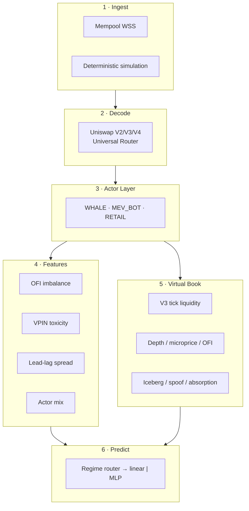
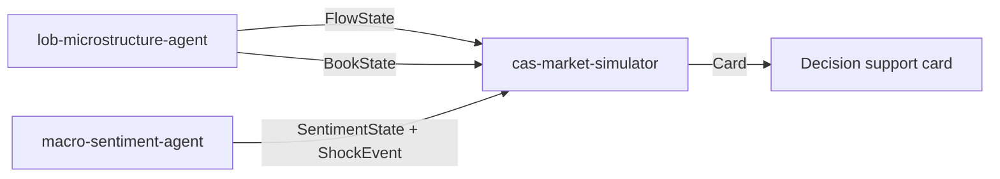

<div align="center">

# 🔬 lob-microstructure-agent

**Real-time DEX market microstructure analysis engine**
_From mempool to actor labeling, from order-flow reads to a virtual order book._

<br/>


**🇬🇧 English** · [🇹🇷 Türkçe](README.md)

</div>

---

> ⚠️ **Research / PoC — not investment advice.** The probabilities and labels produced are *observational and predictive inferences*, not certainties.

---

## 🎯 What does it do?

It watches **pending swaps** in the Ethereum mempool, decodes Uniswap V2/V3/V4 + Universal Router calls, and classifies the actor behind each transaction:

```text
⚑ WHALE    — large-volume, direction-setting trade
⚑ MEV_BOT  — sandwich / JIT / arbitrage hunter
⚑ RETAIL   — small, momentum follower
```

From this flow it produces **order-flow imbalance**, **VPIN toxicity**, **actor mix**, and a short-term direction probability. In addition, thanks to a V3-style **virtual order book**, you can read an AMM like a classic L2 book and compute the expected price impact.

> The goal is not a "buy/sell now" machine; it is to **measure the microstructure of the market transparently** and expose it to upstream systems as raw metrics.

---

## 🏗️ Architecture



---

## 📦 Key Features

| Layer | Feature | Output |
|---|---|---|
| **Decode** | V2 `swapExact*`, V3 `exactInputSingle`, Universal Router `execute()` | Direction, token, volume |
| **Actor** | Wallet profile + gas + coinbase.transfer detection | WHALE / MEV_BOT / RETAIL label |
| **MEV** | Sandwich, JIT liquidity, atomic arbitrage, builder tip | Text-annotated report |
| **Features** | OFI, VPIN, lead-lag, fracdiff | `FlowState` contract |
| **Book** | V3 virtual book, L2/L3 reads | `BookState` contract |
| **Predict** | Regime router + LogReg / NumPy MLP + meta-labeling | `prob_up`, `regime` |

---

## 🚀 Quick Start

```bash
pip install -r requirements.txt
# or editable
pip install -e ".[dev]"

# Simulation mode — no RPC/key required
python main.py

# Model calibration
python train.py

# Tests
pytest -q          # 140 tests, all green
```

When `WSS_URL` is left empty, the system automatically falls back to **simulation mode** and runs end-to-end without a real node connection.

---

## 🔗 Place in the CAS Ecosystem

In the hybrid CAS plan, this repo acts as the **microstructure sensory organ**:



The contracts are loosely coupled; `cas-market-simulator` depends only on the `FlowState` / `BookState` / `SentimentState` types.

---

## ⚖️ Disclaimer

The system is for **research and educational purposes only**. It does not submit automated orders and does not provide investment advice. Crypto trading carries significant risk; the authors are not responsible for any losses.

## 📄 License

MIT — see [LICENSE](LICENSE).
