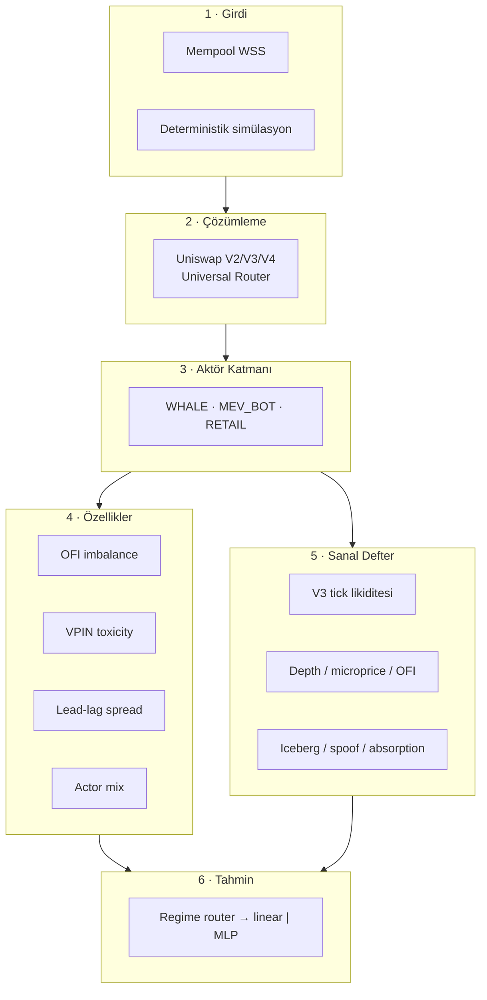
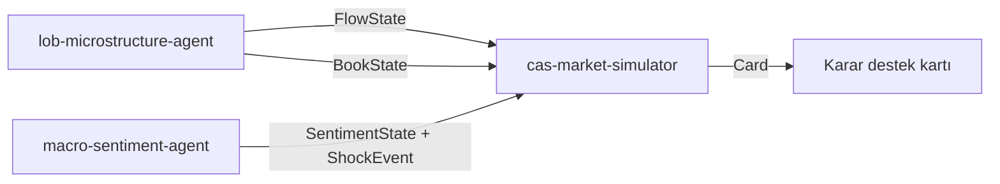

<div align="center">

# 🔬 lob-microstructure-agent

**Gerçek zamanlı DEX piyasa mikroyapısı analiz motoru**
_Mempool'dan aktör etiketlemeye, order-flow okumalarından sanal emir defterine._

<br/>


</div>

---

> ⚠️ **Araştırma / PoC — yatırım tavsiyesi değildir.** Üretilen olasılıklar ve etiketler *gözlem ve tahmine dayalı çıkarımlardır*; kesinlik değildir.

---

## 🎯 Ne işe yarar?

Ethereum mempool'undaki **pending swap'ları** izler, Uniswap V2/V3/V4 + Universal Router çağrılarını çözer ve her işlemin arkasındaki aktörü sınıflandırır:

```text
⚑ WHALE    — büyük hacimli, yön belirleyici işlem
⚑ MEV_BOT  — sandwich / JIT / arbitraj avcısı
⚑ RETAIL   — küçük, momentum takipçisi
```

Bu akıştan **order-flow imbalance**, **VPIN toksisitesi**, **aktör karışımı** ve kısa vadeli yön olasılığı üretilir. Ayrıca V3-stil **sanal emir defteri** sayesinde AMM'yi klasik bir L2 defteri gibi okuyabilir, beklenen fiyat etkisini hesaplayabilirsiniz.

> Amaç bir "şimdi al/sat" makinesi değil; **piyasanın mikro yapısını şeffaf biçimde ölçmek** ve bunu üst sistemlere ham metrik olarak sunmaktır.

---

## 🏗️ Mimari



---

## 📦 Başlıca Özellikler

| Katman | Özellik | Çıktı |
|---|---|---|
| **Decode** | V2 `swapExact*`, V3 `exactInputSingle`, Universal Router `execute()` | Yön, token, hacim |
| **Actor** | Cüzdan profili + gas + coinbase.transfer tespiti | WHALE / MEV_BOT / RETAIL etiketi |
| **MEV** | Sandwich, JIT likidite, atomik arbitraj, builder tip | Metin açıklamalı rapor |
| **Features** | OFI, VPIN, lead-lag, fracdiff | `FlowState` sözleşmesi |
| **Book** | V3 sanal defter, L2/L3 okumaları | `BookState` sözleşmesi |
| **Predict** | Regime router + LogReg / NumPy MLP + meta-labeling | `prob_up`, `regime` |

---

## 🚀 Hızlı Başlangıç

```bash
pip install -r requirements.txt
# veya editable
pip install -e ".[dev]"

# Simülasyon modu — RPC/anahtar gerekmez
python main.py

# Model kalibrasyonu
python train.py

# Testler
pytest -q          # 140 test, tamamı yeşil
```

`WSS_URL` boş bırakıldığında sistem otomatik **simülasyon moduna** düşer; gerçek node bağlantısı olmadan uçtan uca çalışır.

---

## 🔗 CAS Ekosistemindeki Yeri

Bu repo, hibrit CAS planında **mikroyapı duyu organı** görevi görür:



Sözleşmeler gevşek bağlıdır; `cas-market-simulator` yalnızca `FlowState` / `BookState` / `SentimentState` tiplerine bağımlıdır.

---

## ⚖️ Sorumluluk Reddi

Sistem yalnızca **araştırma ve eğitim amaçlıdır**. Otomatik emir göndermez, yatırım tavsiyesi vermez. Kripto ticareti önemli risk taşır; yazarlar hiçbir kayıptan sorumlu değildir.

## 📄 Lisans

MIT — bkz. [LICENSE](LICENSE).
