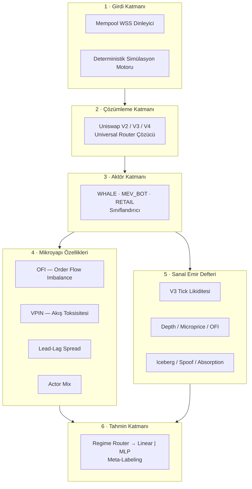
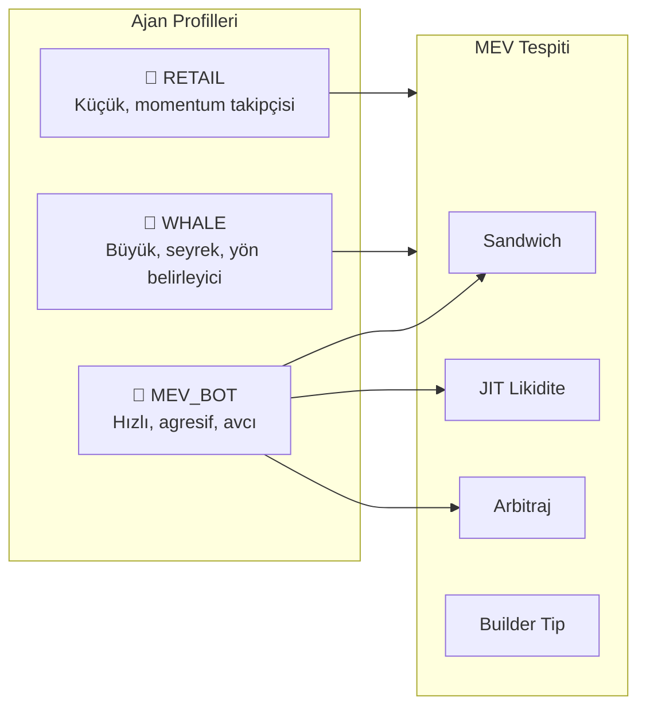
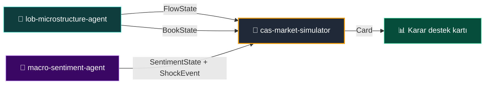

<div align="center">

# 🔬 lob-microstructure-agent

**Gerçek zamanlı DEX piyasa mikroyapısı analiz motoru**  
_Mempool'dan aktör etiketlemeye, order-flow okumalarından sanal emir defterine._

<br/>


</div>

---

> ⚠️ **Araştırma / PoC — yatırım tavsiyesi değildir.**  
> Üretilen olasılıklar ve etiketler *gözlem ve tahmine dayalı çıkarımlardır*; kesinlik değildir.

---

## 📌 İçindekiler

- [Proje Özeti](#-proje-özeti)
- [Mimari Genel Bakış](#-mimari-genel-bakış)
- [Başlıca Özellikler](#-başlıca-özellikler)
- [Hızlı Başlangıç](#-hızlı-başlangıç)
- [Modül / Katman Rehberi](#-modül--katman-rehberi)
- [Veri Sözleşmeleri](#-veri-sözleşmeleri)
- [Ajan Şablonları ve MEV](#-ajan-şablonları-ve-mev)
- [Eğitim ve Kalibrasyon](#-eğitim-ve-kalibrasyon)
- [Dashboard](#-dashboard)
- [CAS Ekosistemindeki Yeri](#-cas-ekosistemindeki-yeri)
- [Testler](#-testler)
- [Sözlük](#-sözlük)
- [Sorumluluk Reddi ve Lisans](#-sorumluluk-reddi-ve-lisans)

---

## 🎯 Proje Özeti

`lob-microstructure-agent`, Ethereum (ve EVM-uyumlu) zincirlerin **mempool** katmanından başlayarak, merkeziyetsiz borsa (DEX) işlemlerinin **kim**, **ne zaman**, **ne kadar** ve **ne amaçla** yapıldığını okumaya çalışan bir **piyasa mikroyapısı gözlemcisidir**.

Sistem, pending swap'ları izler, Uniswap V2/V3/V4 + Universal Router çağrılarını çözer ve her işlemin arkasındaki aktörü sınıflandırır:

```text
⚑ WHALE    — büyük hacimli, yön belirleyici işlem
⚑ MEV_BOT  — sandwich / JIT / arbitraj avcısı
⚑ RETAIL   — küçük, momentum takipçisi
```

Bu akıştan **order-flow imbalance** (emir akışı dengesizliği), **VPIN toksisitesi** (toksik akış), **aktör karışımı** ve kısa vadeli yön olasılığı üretilir. Ayrıca V3-stil **sanal emir defteri** sayesinde AMM'yi klasik bir L2/L3 defteri gibi okuyabilir, beklenen fiyat etkisini ve gizli piyasa davranışlarını (iceberg, spoofing, absorption) hesaplayabilirsiniz.

> Amaç bir "şimdi al/sat" makinesi değil; **piyasanın mikro yapısını şeffaf biçimde ölçmek** ve bunu üst sistemlere ham metrik olarak sunmaktır.

---

## 🏗️ Mimari Genel Bakış

Sistem, boru hattı şeklinde 6 ana katmandan oluşur. Her katman kendine özgü bir sorumluluk üstlenir ve bir sonrakine yapılandırılmış veri iletir:



### 🧩 Katmanların İşleyişi

| Katman | Görevi | Girdi | Çıktı |
|---|---|---|---|
| **1. Girdi** | Mempool'dan canlı tx al veya deterministik simülasyon üret | WSS URL veya seed | `PendingTx` |
| **2. Decode** | Router çağrılarını çözümle | `PendingTx` | `DecodedSwap` |
| **3. Actor** | Cüzdan profili + gas + davranış ile etiketle | `DecodedSwap` | `ActorSignal` |
| **4. Features** | Zaman pencerelerinde akış metrikleri hesapla | `ActorSignal` akışı | `FlowFeatures` |
| **5. Book** | L2/L3 sanal defter okumaları | `RawBook` + tape | `BookState` |
| **6. Predict** | Rejim bazlı yön tahmini ve meta-boyutlandırma | `FlowFeatures` + `BookState` | `PricePrediction` |

---

## 📦 Başlıca Özellikler

| Alan | Özellik | Açıklama |
|---|---|---|
| 🔍 **Decode** | V2 `swapExact*`, V3 `exactInputSingle`, Universal Router `execute()` | Yön, token, hacim çıkarımı |
| 🏷️ **Actor** | Cüzdan profili + gas + coinbase.transfer tespiti | WHALE / MEV_BOT / RETAIL etiketi |
| ⚡ **MEV** | Sandwich, JIT likidite, atomik arbitraj, builder tip | Metin açıklamalı MEV raporu |
| 📊 **Features** | OFI, VPIN, lead-lag, fracdiff | `FlowState` sözleşmesi |
| 📖 **Book** | V3 sanal defter, L2/L3 okumaları | `BookState` sözleşmesi |
| 🧠 **Predict** | Regime router + LogReg / NumPy MLP + meta-labeling | `prob_up`, `regime` |
| 🧪 **Simülasyon** | Anahtarsız, deterministik, seed'li | `WSS_URL` boşken otomatik çalışır |
| 🔌 **CAS Köprüsü** | `FlowFeed` & `BookFeed` adaptörleri | `cas-market-simulator` ile gevşek bağlı entegrasyon |

---

## 🚀 Hızlı Başlangıç

### 1. Kurulum

```bash
# Repoyu klonla
git clone https://github.com/7mertyavuz/lob-microstructure-agent.git
cd lob-microstructure-agent

# Bağımlılıkları kur
pip install -r requirements.txt
# veya editable geliştirici kurulumu
pip install -e ".[dev]"
```

### 2. Çalıştırma

```bash
# Simülasyon modu — RPC/anahtar gerekmez
python main.py

# Model kalibrasyonu
python train.py

# Testler
pytest -q          # 140 test, tamamı yeşil
```

`WSS_URL` boş bırakıldığında sistem otomatik **simülasyon moduna** düşer; gerçek node bağlantısı olmadan uçtan uca çalışır.

### 3. Canlı Mod (Opsiyonel)

```bash
# .env dosyası oluştur
cp .env.example .env

# WSS_URL'i Ethereum node'unuzun WebSocket ucuyla doldurun
# WSS_URL=wss://mainnet.infura.io/ws/v3/YOUR_KEY

python main.py
```

---

## 📚 Modül / Katman Rehberi

### `src/ingest/` — Girdi Katmanı

- **`mempool_listener.py`**: WebSocket üzerinden mempool tx'lerini dinler veya deterministik simülasyon üretir.
- Canlı modda `WSS_URL`'e bağlanır; simülasyon modunda seed'li `PendingTx` akışı üretir.

### `src/decode/` — Çözümleme Katmanı

- **`tx_decoder.py`**: Uniswap V2/V3/V4 ve Universal Router çağrılarını çözümleyerek `DecodedSwap` üretir.
- Bilinen router adresleri ve metod imzalarıyla çalışır.

### `src/actor/` — Aktör Katmanı

- **`classifier.py`**: Swap'ı WHALE / MEV_BOT / RETAIL olarak etiketler.
- **`wallet_profiler.py`**: Cüzdan yaş, bakiye, hacim gibi özellikleri çıkarır.
- **`onchain_profiler.py`**: Zincir üstü ek sinyallerle profili zenginleştirir.
- **`agent_profiles.py`**: CAS simülatörü için profil şablonları (`WHALE`, `MEV_BOT`, `RETAIL`).

### `src/mev/` — MEV Tespiti

| Modül | Görev |
|---|---|
| `sandwich.py` | Sandwich saldırısı şüphesi |
| `jit_liquidity.py` | Just-In-Time likidite tespiti |
| `arbitrage.py` | Atomik arbitraj sinyali |
| `builder_tip.py` | Builder tip analizi |
| `decision.py` | Simülatör-dostu karar cephesi |
| `zeromev_client.py` | ZeroMEV API entegrasyonu |

### `src/features/` — Mikroyapı Özellikleri

- **`window.py`**: `RollingFlow` — kayan zaman penceresinde akış metrikleri.
- **`vpin.py`**: VPIN (Volume-Synchronized Probability of Informed Trading) hesabı.
- **`lead_lag.py`**: CEX-DEX lead-lag spreadi.
- **`fracdiff.py`**: Kısmi fark alma (fracdiff) özellikleri.

### `src/book/` — Sanal Emir Defteri

- **`state.py`**: `RawBook`, `BookLevel`, `Trade`, `OrderEvent`, `BookState` veri modelleri.
- **`features.py`**: Derinlik dengesizliği, microprice, OFI, book slope, Kyle's λ, iceberg, spoofing, absorption, sweep, likidasyon skew.
- **`sim.py`**: Deterministik sentetik L2 defter üreteci.
- **`keeper.py`**: Canlı CEX/Binance defter yeniden inşası.
- **`feed.py`**: `BookFeed` okuma arayüzü.
- **`dex_virtual_book.py`**: Uniswap V3 tick likiditesinden sanal defter.

### `src/predict/` — Tahmin Katmanı

| Modül | Görev |
|---|---|
| `direction.py` | Logistic regresyon tabanlı yön olasılığı (`prob_up`) |
| `regime.py` | VPIN + defter okuma ile rejim yönlendirme (NORMAL / TOXIC / THIN) |
| `meta.py` | Meta-labeling ile pozisyon boyutu (López de Prado, AFML Bölüm 3) |
| `mlp.py` | Saf NumPy MLP stand-in |
| `economic.py` | Maliyet-duyarlı filtreleme |

### `src/train/` — Eğitim Altyapısı

- **`dataset.py`**: Sentetik ve CSV veri yükleyici.
- **`logreg.py`**: Saf NumPy logistic regresyon.
- **`backtest.py`**: Walk-forward bölme, metrik ve katsayı kaydetme.
- **`online.py`**: Online öğrenme / drift izleme.

### `src/api/` — CAS Köprüsü

- **`flow_feed.py`**: `FlowFeed.latest(token) -> FlowState` arayüzü.
- **`sim_env.py`**: Simülatörden enjekte edilen emirleri kabul eden çevre adaptörü.

### `src/pipeline/` — Mesaj Boru Hattı

- **`bus.py`**: Bellek-içi veya Redis/Kafka backend'li olay otobüsü.

### `src/dashboard/` — Canlı Dashboard

- **`hub.py`**: WebSocket üzerinden istemcilere broadcast.

---

## 🔗 Veri Sözleşmeleri

Bu repo, `cas-market-simulator` ile gevşek bağlı çalışmak için iki ana veri sözleşmesi üretir. Tam şema için bkz. [`docs/00-ORTAK-SOZLESME.md`](docs/00-ORTAK-SOZLESME.md).

### `FlowState` — Akış Sözleşmesi

Mikroyapı analizinin motor tarafına iletilen ham metrikleridir. **Ağırlık kararı vermez**; sadece gözlemlenen akışı raporlar.

| Alan | Aralık | Anlamı |
|---|---|---|
| `flow_imbalance` | `[-1, 1]` | Net alış/satış baskısı |
| `vpin_toxicity` | `[0, 1]` | Bilgili akış / toksisite şüphesi |
| `whale_net_usd` | serbest | Pencere içi balina net akışı (USD) |
| `actor_mix` | `dict` | WHALE / MEV_BOT / RETAIL oranları |
| `direction_prob_up` | `[0, 1]` | Kısa vadeli yukarı olasılığı |
| `lead_lag_spread` | serbest | CEX-DEX gecikme düzeltmeli spread |
| `regime` | `normal` \| `toxic` \| `highvol` | Akış rejimi |

### `BookState` — Defter Sözleşmesi

L2/L3 defter okumalarının motor tarafına iletilen ham metrikleridir. `FlowState`'ten ayrı tutulur; çift sayım riski motor tarafında yönetilir.

| Alan | Aralık | Anlamı |
|---|---|---|
| `spread_bps` | `≥0` | En iyi alış-satış farkı (bps) |
| `microprice` | `>0` | Derinlik-ağırlıklı adil fiyat (Stoikov) |
| `depth_imbalance` | `[-1, 1]` | Çok seviyeli derinlik dengesizliği |
| `ofi` | serbest | Event-bazlı order flow imbalance |
| `queue_imbalance` | `[-1, 1]` | En iyi seviye kuyruk dengesizliği |
| `book_slope` | `≥0` | Defter eğimi / esneklik |
| `kyle_lambda` | `≥0` | Hacim başına fiyat etkisi |
| `iceberg_score` | `[0, 1]` | Gizli likidite **şüphesi** |
| `spoof_score` | `[0, 1]` | Yanıltıcı katmanlama **şüphesi** |
| `absorption` | `[-1, 1]` | + = satış baskısı emiliyor |
| `liq_map_skew` | `[-1, 1]` | Likidasyon yoğunluğu üstte(+) / altta(-) |

> ⚠️ `iceberg_score` ve `spoof_score` **kanıt değil şüphedir**. Tek başına yön oyu vermez, güven çarpanı olarak kullanılır.

---

## 🤖 Ajan Şablonları ve MEV

Sistem, mempool'u okurken aynı zamanda farklı katılımcı tiplerinin davranış şablonlarını da çıkarır. Bu şablonlar, CAS simülatöründe sentetik ajanların temelini oluşturur.



Her profil şu özelliklerle tanımlanır:

| Profil | Tipik Boyut | Sıklık | Agresyon | Tetikleyici |
|---|---|---|---|---|
| **WHALE** | $100K+ | Düşük | Orta | Yönsel konum / bilgi |
| **MEV_BOT** | Değişken | Yüksek | Çok yüksek | Önden koşma / arbitraj |
| **RETAIL** | <$10K | Yüksek | Düşük | Sosyal momentum / FOMO |

---

## 🎓 Eğitim ve Kalibrasyon

Yön modeli, katsayılarını `models/direction_coeffs.json`'dan yükler. Eğer dosya yoksa makul varsayılanlar kullanılır.

```bash
# Sentetik veriyle katsayı kalibrasyonu
python train.py

# Gerçek etiketli CSV ile
# CSV kolonları: flow_imbalance, whale_net_usd, label
python train.py veri.csv
```

### Model Formülü

```text
z = b0 + b1 * imbalance + b2 * tanh(whale_net / scale)
prob_up = sigmoid(z)
```

- `b0`, `b1`, `b2`: `train.py` ile öğrenilir.
- Defter okumaları (`BookState`) düşük ağırlıkla (`BOOK_WEIGHT = 0.35`) eklenir.
- Spoofing skoru yüksekse `depth_imbalance`'ın güveni kısılır.
- Yüksek VPIN / ince defterde tahmin 0.5'e doğru yumuşatılır.

---

## 📺 Dashboard

Canlı dashboard, pipeline'ı çalıştırır ve her `ActorSignal` ile `PricePrediction`'ı WebSocket üzerinden tarayıcıya gönderir.

```bash
python dashboard.py
```

Ardından `dashboard.html`'i tarayıcıda açın (`ws://localhost:8765` üzerinden bağlanır).

Dashboard gösterimleri:

- Gerçek zamanlı aktör etiketleri
- Token bazlı yön tahminleri
- Akış imbalance ve balina net akışı
- Rejim durumu (normal / toksik / yüksek volatilite)

---

## 🌐 CAS Ekosistemindeki Yeri

Bu repo, hibrit CAS planında **mikroyapı duyu organı** görevi görür:



Sözleşmeler gevşek bağlıdır; `cas-market-simulator` yalnızca `FlowState` / `BookState` tiplerine bağımlıdır. Bu sayede her repo kendi CI/CD'sinde bağımsız gelişebilir.

---

## ✅ Testler

```bash
pytest -q
```

Proje, 140'tan fazla birim test içerir. Test kapsamı şunları içerir:

- Decode doğruluğu (V2/V3/Universal Router)
- Aktör sınıflandırması
- OFI / VPIN / lead-lag hesaplamaları
- Defter özellikleri (depth imbalance, microprice, Kyle's λ)
- L3-türevi skorlar (iceberg, spoof, absorption, sweep)
- Regime router ve meta-labeler
- `FlowFeed` / `BookFeed` sözleşme uygunluğu
- Determinizm (aynı seed → aynı çıktı)

---

## 📖 Sözlük

| Terim | Açıklama |
|---|---|
| **AMM** | Automated Market Maker — otomatik piyasa yapıcı (Uniswap vb.). |
| **Book Slope** | Defter eğimi; fiyatın mesafeyle ne kadar dirençle karşılaştığını gösterir. |
| **CEX** | Centralized Exchange — merkezi borsa (Binance, Coinbase vb.). |
| **DEX** | Decentralized Exchange — merkeziyetsiz borsa (Uniswap vb.). |
| **Iceberg** | Büyük emrin parçalar halinde gizli şekilde sunulması. |
| **JIT Likidite** | Just-In-Time liquidity; işlem öncesi anlık eklenen ve hemen çekilen likidite. |
| **Kyle's λ** | Hacim başına fiyat etkisi; piyasanın derinliğini ölçer. |
| **Lead-Lag** | İki piyasa arasında fiyat hareketlerinin zaman farkı. |
| **MEV** | Maximal Extractable Value — blok üreticileri/botlar tarafından çıkarılabilen maksimum değer. |
| **Meta-Labeling** | Birincil modelin ne zaman haklı olduğunu tahmin eden ikinci katman model. |
| **Microprice** | Derinlik-ağırlıklı adil fiyat; mid fiyattan daha bilgilidir. |
| **Mempool** | Onay bekleyen işlemlerin havuzu. |
| **OFI** | Order Flow Imbalance — alış/satış baskısı dengesizliği. |
| **Spoofing** | Yanıltıcı büyük emirlerle piyasa algısını değiştirme girişimi. |
| **VPIN** | Volume-Synchronized Probability of Informed Trading — bilgili akış/toksisite ölçüsü. |
| **WSS** | WebSocket Secure — güvenli WebSocket bağlantısı. |

---

## ⚖️ Sorumluluk Reddi ve Lisans

Sistem yalnızca **araştırma ve eğitim amaçlıdır**. Otomatik emir göndermez, yatırım tavsiyesi vermez. Kripto ticareti önemli risk taşır; yazarlar hiçbir kayıptan sorumlu değildir.

**Lisans:** MIT — bkz. [LICENSE](LICENSE).

---

<div align="center">

**Built with pure Python + NumPy** · Deterministik · Simülasyon-first · Gevşek bağlı

</div>
